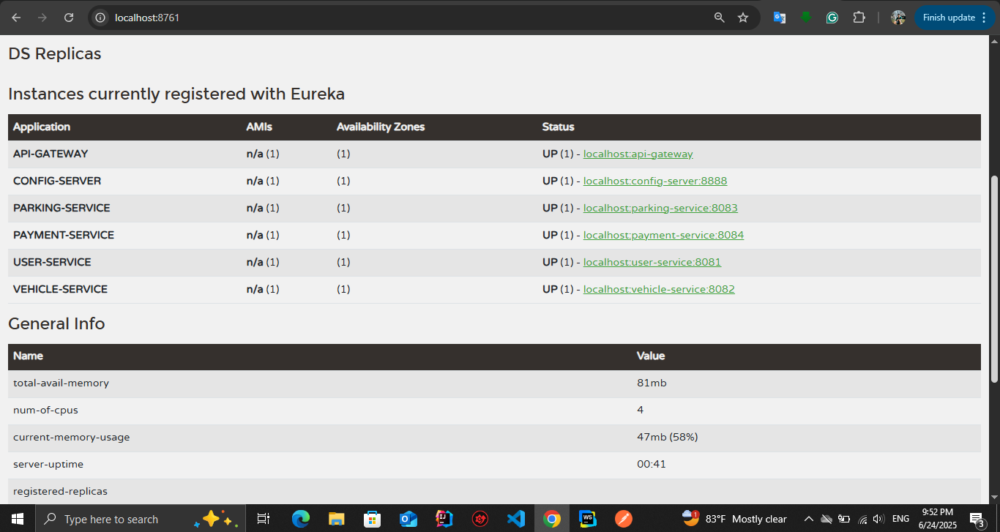

# Smart Parking Management System

## 📁 Resources
- 🧪 [Postman Collection](./postman-collection.json)

- 📸 Eureka Dashboard Screenshot:
-


The Smart Parking Management System (SPMS) is a microservice-based application designed to manage parking lots, spaces, vehicles, users, and payments efficiently. It allows vehicle owners to find and reserve parking spaces, and provides administrators with real-time monitoring of parking occupancy and payment statuses.

## 🧩 Microservices Architecture

- **API Gateway** – Handles routing and authentication using JWT.
- **Eureka Server** – Service registry for discovering all microservices.
- **User Service** – Manages user registration, login, and authentication.
- **Vehicle Service** – Stores and manages vehicle data.
- **Parking Service** – Manages parking lots and spaces.
- **Payment Service** – Processes payments based on parking duration.
- **Parking Record Service** – Tracks entry/exit of vehicles.

---

## 🚀 How to Run

### 📦 Prerequisites
- Java 17+
- Maven or Gradle
- Spring Boot
- MySQL
- IntelliJ / VS Code (optional)

### 🛠️ Setup Steps

1. **Clone the Repository**
   ```bash
   git clone https://github.com/your-username/spms.git
   cd spms